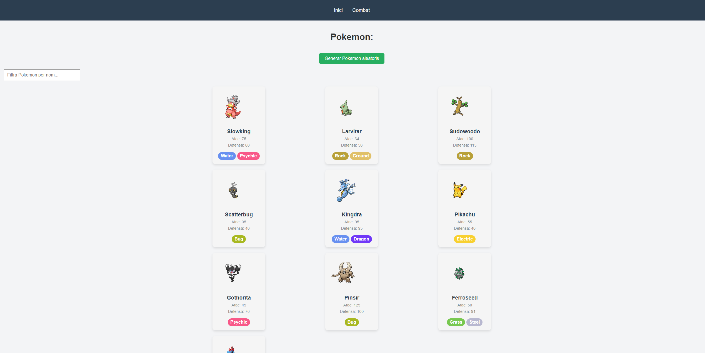
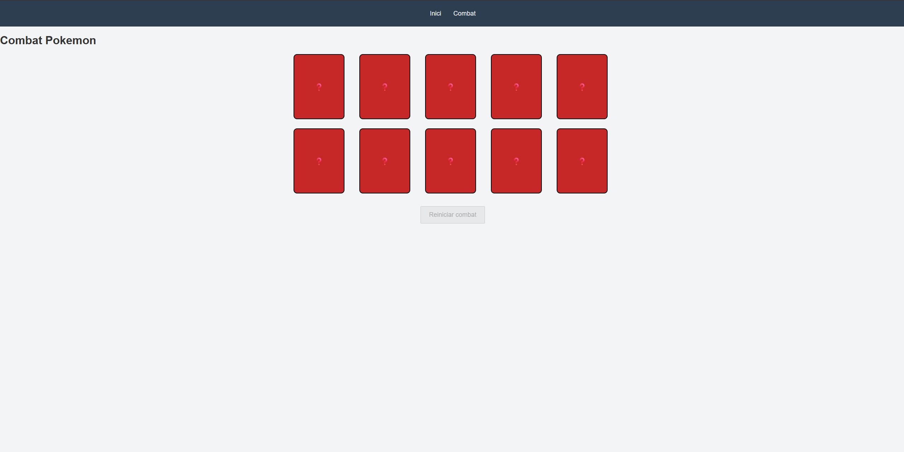
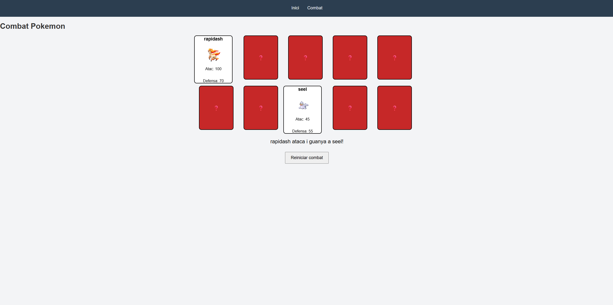

# 📌 Pokémon Web App

This is a web application developed using HTML5, CSS3, and JavaScript for my course at UOC.  
The project uses the Pokémon API to dynamically generate Pokémon cards and includes interactive features such as searching and battling Pokémon.

> ⚠️ **Note:** All content is written in Catalan.

## 🚀 Screenshots

## 🧩 Features

### 🏠 Home Page
- ✅ Generates 10 random Pokémon cards using the Pokémon API
- ✅ Each card displays:
  - Pokémon name
  - Image
  - Attack
  - Defense
  - Types (with corresponding colors)
- ✅ Button to generate 10 new random Pokémon
- ✅ Search bar to filter Pokémon by name (only among generated Pokémon)

### ⚔️ Combat Page
- ✅ Generates 10 random Pokémon cards face down
- ✅ Player selects two Pokémon to battle
- ✅ Simple combat system:
  - If Pokémon A’s **attack** is higher than Pokémon B’s **defense**, Pokémon A wins
  - Otherwise, Pokémon B wins
- ✅ Button to restart and regenerate the cards

## 🛠️ Technologies

- HTML5
- CSS3
- JavaScript (ES6)
- Pokémon API

## 🌐 API Used

- [PokéAPI](https://pokeapi.co/)

## 📄 Notes

- This project focuses on DOM manipulation, API consumption, and basic game logic.
- The combat system is intentionally simple and rule-based for learning purposes.
